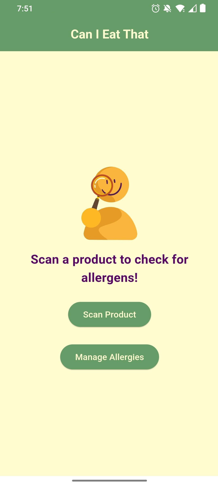
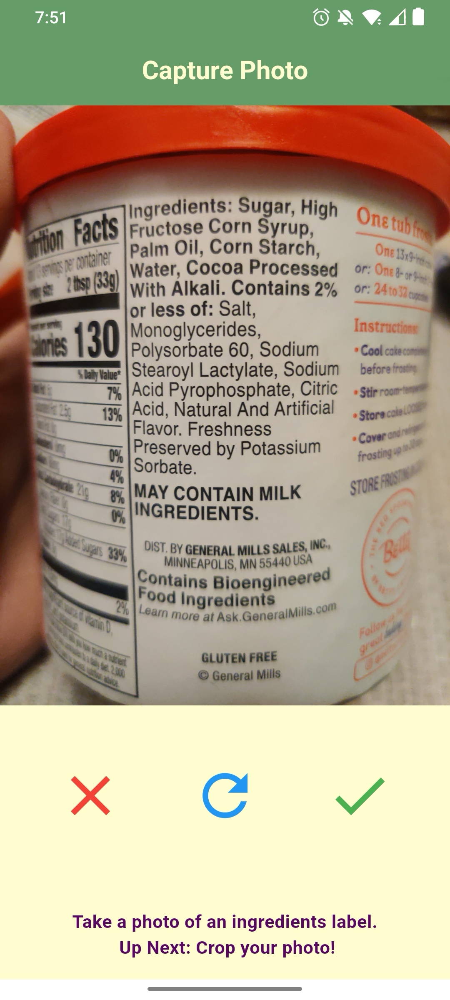
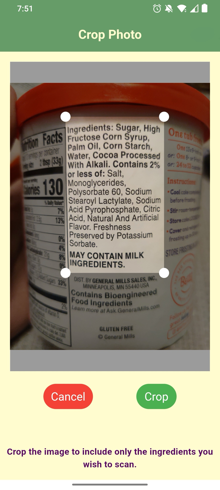
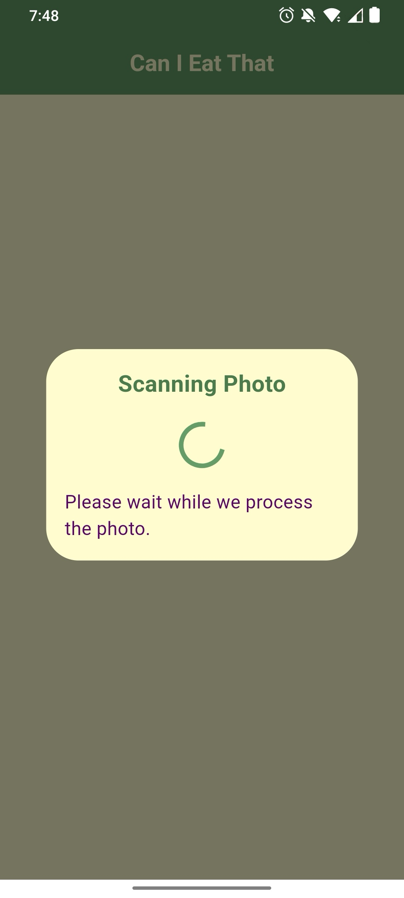
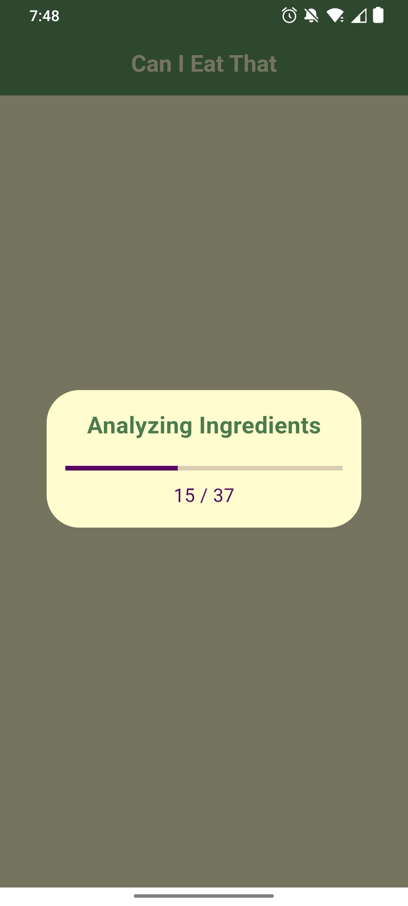
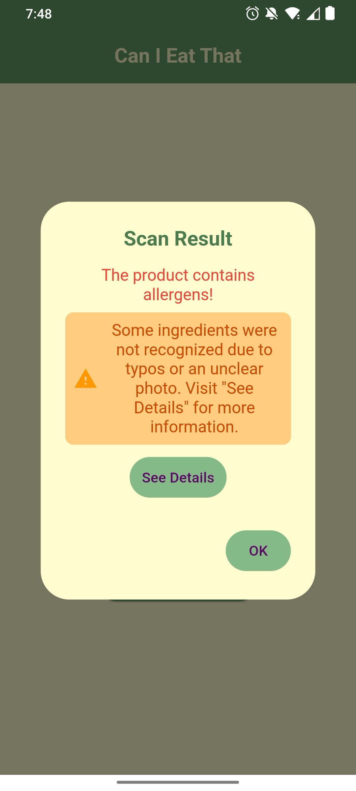

# can_i_eat_that

A flutter app that checks whether or not a user with allergies can eat a food product by scanning the ingredients label.

## Features

- **Quick Allergen Scanning:** Efficiently check an ingredients label for allergens.
- **Customizable Allergen List:** Add and remove your allergens as needed.
- **Color-Coded Results:** Clear, color-coded messages to indicate safety.
- **Simple UI:** A simple and intuitive user interface for an easy user experience.

## Demo

Here are some screenshots demonstrating different features of the app in order of how it's used:

| **Home Screen Demo** | **Manage Allergies Screen** | **Capture Image Demo** | **Crop Image Demo** | **Processing Demo** | **Analyzing Demo** | **Scan Results Demo** | **Matching Allergens Screen** |
|----------------------|-----------------------------|------------------------|----------------------|---------------------|---------------------|------------------------|-------------------------------|
|  |  |  |  |  |  |  | 


## Installation

To get started with this project, follow these steps:

1. **Clone the Repository:**

   ```bash
   git clone https://github.com/ananya-nadendla/can_i_eat_that.git
   ```

2. **Navigate to the Project Directory:**

   ```bash
   cd can_i_eat_that
   ```

3. **Install Dependencies:**

   Make sure you have [Flutter](https://flutter.dev/docs/get-started/install) installed. Then, run:

   ```bash
   flutter pub get
   ```

4. **Set Up Environment Variables:**

   Follow the instructions in the [**Environment Configuration**](#environment-configuration) section to set up your `.env` file.

5. **Run the App:**

   ```bash
   flutter run
   ```

## Usage
### Environment Configuration

This project uses an environment file (`.env`) to store API Keys for security purposes.

#### Setting Up the `.env` File

1. **Copy the Sample File:**

   Create a copy of the `.env_sample` file and name it `.env` in the root directory of your project.

2.  **Sign Up For Merriam-Webster API**

    Sign Up Link: https://dictionaryapi.com/register/index **(its free!)**
    - For "Request API Key (1)", choose "Collegiate Dictionary" from dropdown
    - For "Request API Key (2)", choose "Medical Dictionary" from dropdown


4. **Add Your API Keys:**

   Open the `.env` file and replace the placeholder values with your actual API keys. For example:

   ```plaintext
   # Your Merriam-Webster Collegiate API Key
   API_KEY_MERRIAM_WEBSTER_COLLEGIATE_DICTIONARY=your_actual_collegiate_api_key

   # Your Merriam-Webster Medical API Key
   API_KEY_MERRIAM_WEBSTER_MEDICAL_DICTIONARY=your_actual_medical_api_key

## Privacy Statement

### Image Privacy

Privacy is important. The `can_i_eat_that` app takes your images of ingredient labels solely for the purpose of identifying allergens. 

- **Temporary Storage:** Images are temporarily stored only during the scanning process. They are used to process and analyze ingredient labels and are not retained beyond this process. Images are not stored or saved long-term. 

- **Third-Party Sharing:** 
   - Our app uses the **Google ML Kit** for image processing and analysis. Images are sent to Google ML Kit APIs to perform necessary tasks such as text recognition.
   - **Google’s Privacy Practices**: We do not control how Google handles the data. Please refer to Google’s Privacy Policy for details on how your data is managed and protected.
